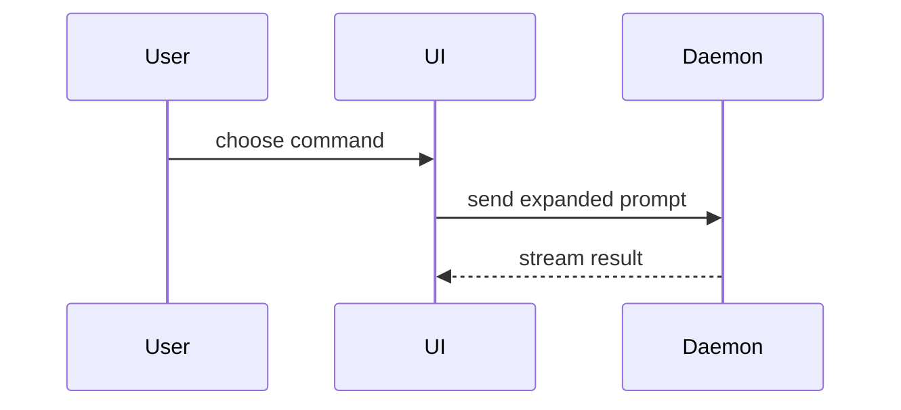

# Create PR

Commit the task changes, push the branch, and create a pull request.

## Navigation

```text
Create the pull request
├─ Inspect and publish the branch       → Steps
├─ Choose the smallest reviewer view   → Evidence selection
├─ Explain runtime or state flow        → Change-shape evidence
├─ Show a user-visible change           → Visual evidence
└─ Confirm the remote result            → Final verification
```

## Steps

1. Confirm the repository, worktree, branch, HEAD SHA, and remote.
2. Run `git status` and preserve unrelated user changes.
3. Run `git diff` to understand the task changes.
4. Run `git log` to see the commit message style.
5. Run the repository quality gate.
6. Stage only the task changes.
7. Commit with a concise Conventional Commit message.
8. Push the branch to the remote with `-u`.
9. Create the pull request with `gh pr create`.
10. Select the smallest reviewer view that explains each important change.
11. Add change-shape evidence when the change affects runtime flow, state, ownership, or module boundaries.
12. Add visual evidence when the change affects a visible interface.
13. Apply each requested person to each requested assignee and reviewer role.

## PR Body Format

```
## Problem / Intent

[Why this change exists - the problem being solved or feature being added]

## Approach

[High-level concept of the solution - not a list of file changes]

## Review Guide

[Optional. Add only the smallest diagrams or shape diffs needed to understand the important change.]
```

## Rules

- PR title should be succinct (no "feat:" prefix, but "fix:" is ok for bug fixes)
- Do NOT include a summary of code changes or files modified
- Do NOT include a test plan with checkboxes
- Do NOT include "Generated with Claude Code" or similar footers
- Keep the PR description concise and focused on intent and approach
- Omit the review guide when prose already makes the change clear
- Use HEREDOC for the PR body to preserve formatting

## Evidence Selection

Pick the smallest view that makes the important change clear. Use several views only when each view answers a different review question.

| Review question | Use |
| --- | --- |
| What logic or order changed? | Short pseudocode or state-flow diff |
| Which functions call each other? | Call tree or call-tree diff |
| Which component owns the state or action? | Component tree or component-tree diff |
| Which module owns each responsibility? | Shallow file tree or file-tree diff |
| How do several processes or services interact? | Mermaid sequence or flow diagram |
| What changed inside a known shape? | Focused `diff` block |
| Is most of the target shape new? | One complete, copyable block |
| What does the user now see? | Screenshot or before-and-after images |

Apply these rules:

- Keep only the calls, files, props, states, and boundaries needed for review.
- Put each view next to the short text that it supports.
- Use real names and paths from the final code.
- Use `diff` when the existing shape gives useful context.
- Show the complete block when omitted context would hide ownership or order.
- Do not add every evidence type.
- Do not create a standalone HTML artifact for a pull request. Use GitHub-rendered Markdown, Mermaid, or stable images.

## Change-Shape Evidence

Add numbered inline review-guide comments at key changed lines. State the local callgraph change in each comment.

Use a compact shape in the PR body when reviewers need a broad map. Use an inline comment when the evidence explains one changed line.

### Shape examples

Logic or state flow:

```diff
 on(save)
-  write content
+  if content is unchanged
+    return cached result
   write content
+  invalidate cache
```

Call flow:

```diff
 submitForm
   createSession
     persistPrompt
+    expandSkillMention
     launchAgent
   navigateToSession
+    subscribeToEvents
```

Component ownership:

```diff
 <SessionPage> (apps/example/src/routes/session.tsx)
   useSessionEvents()
   <SessionToolbar>
+    <RunSkillButton /> (packages/ui)
   <SessionTimeline>
+    <SkillResultCard />
```

File responsibility:

```diff
 src/
 ├── commands/
+│   └── show-me.ts       # expands the command
 ├── sessions/
-└── transport.ts
+└── transport/
+    ├── client.ts
+    └── stream.ts
```

Multi-system interaction:



### Function and component callgraphs

1. Read the PR base SHA and head SHA from GitHub.
2. Fetch the base SHA when a shallow worktree does not contain it.
3. Run a focused callgraph diff for each important entry point.

```bash
bunx https://github.com/tanishqkancharla/calldiff diff <base-sha> <head-sha> \
  --entry <entry-point> --max-depth 3 -- <changed-paths>
```

If the GitHub package has no built executable, use `bunx calldiff@latest`. Verify that its version matches the inspected GitHub source.

Keep the useful `+` and `-` lines. Remove unrelated expansion. Put the reduced ASCII diff in the inline comment.

Use a manual component tree when ownership, props, or state are clearer than a function callgraph. Include the source path only where it helps reviewers locate the boundary.

### XState machines

`calldiff` does not describe declarative machine configuration. Read the exact machine diff. Add a small ASCII transition diff next to the changed state or event.

```diff
  ExistingState
+ └─ NewEvent(payload)
+    ├─ assign context.value
+    └─ NewState
+       ├─ Done
+       │  └─ ExistingState
+       └─ Quit
+          └─ Resetting
```

Show new and removed states, events, guards, actions, and context assignments. Use `+` and `-` markers. Do not invent paths that the machine does not contain.

Skip change-shape evidence for text-only or configuration-only changes with no meaningful runtime, state, ownership, or module-boundary change.

## Visual Evidence

For each user-visible change:

1. Run the changed interface in a representative state.
2. Capture at least one clear screenshot for each distinct changed state.
3. Use before-and-after images when the old state gives useful context.
4. Reuse screenshots already produced during implementation when they show the final code.
5. Upload images to a stable location that pull request viewers can access.
6. Embed the images in the PR body below the approach.
7. Verify that every image renders from the live PR body.

Do not use a local or temporary file path in the PR body. Do not add screenshots to the product branch unless the repository has that convention. Use a dedicated PR asset branch when GitHub attachment upload is not available. Keep asset files out of the product diff.

Skip visual evidence when the change has no visible output.

## Final Verification

After all external changes:

1. Re-read the live PR body.
2. Verify each image URL and rendered image.
3. Verify assignees and requested reviewers.
4. Verify numbered review-guide comments.
5. Verify that each diagram matches the final code and renders on GitHub.
6. Verify the local SHA, remote SHA, and PR head SHA.
7. Treat automation commits as remote changes. Inspect them before a fast-forward.
8. Report pending CI as pending. Do not call the PR green from partial evidence.
